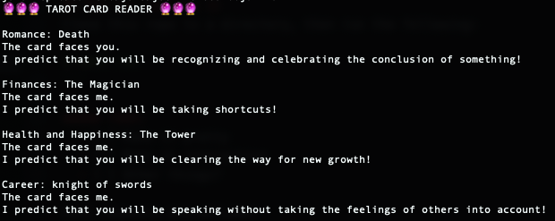

# 🔮 tarot card reader 🔮
Have a computer read your tarot cards! It interprets them too! Since it's a computer, it's 100000% accurate.



## How it works
I used a [json representation](https://github.com/dariusk/corpora/tree/master/data/divination) of tarot interpretations as my tarot deck, and then followed the instructions of a [questionable howcast video](https://www.youtube.com/watch?v=fFUD1N8z2Hk) to do the rest. Everything else is sort of explained in `algorithm`.


## How you can use it
Clone this repo to a directory, then run the following:
```
$ make run
```

##### TODO:
  - [ ] Make it pretty
  - [ ] Make it interactive
  - [ ] Other things?

Pull requests are welcome!
